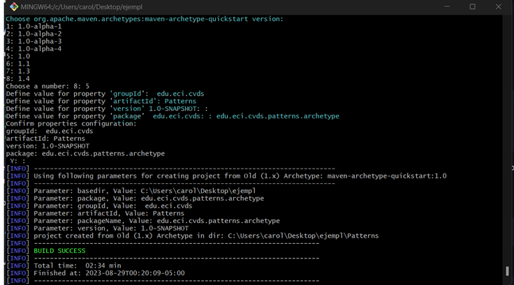

# REALIZADO POR: Andrea Valentina Torres Tobar y Carolina Medina Acero 
## LA HERRAMIENTA MAVEN
### Cuál es su mayor utilidad 
- La mayor utilidad de maven es que permite automatizar la costrucción de proyectos de sofware, pues este permite definir las dependencias del proyecto a través de un archivo pom.xml, posteriormete maven  se encargara de descargar y obtener las bibliotecas necesarias desde el repositorio remoto, simplificando dependencias y evitando problemas de compativilidad. 

### Fases de maven

- Maven  define un conjunto de fases  que conforman el ciclo de vida  de construccion de un proyecto los cuales son: 
1. Validate: Valida que el proyecto es correcto.    
2. Compile: Compila el proyecto.
3. Test: Se ejecutan las pruebas  unitarias del proyecto asegurando que el codigo si este funcionando correctamente.
4. package: Empaqueta los archivos compilados en un formato especifico como JAR (java archive ) WAR (Web Application Archive).
5. Verity: verifica que el codigo empaquetado es valido y cumple con los criterios de calidad.
6. Install: Empaqueta el código en el repositorio local de Maven, para usarlo como dependencia de otros proyectos. 
7. Deploy: Sube el paquete aun lugar  remoto para  que otros puedan acceder a el.

### Ciclo de vida de la construcción

- El ciclo de vida  de  maven es una secuencia de fases que se ejecutan en un orden especifico para llevar a cabo la construccion del proyecto, estan son:

1. Clean Lifecycle: Este ciclo se encarga de limpiar los archivos generados durante la construcción anterior.
2. Default Lifecycle:Cubre todo el proceso de construcción y desarrollo del software (Las fases descritas anteriormente).
3. Site Lifecycle: Genera la documentación del proyecto y crea un sitio web.


### Para qué sirven los plugins
- sirven para  extender  funcionalidades de maven  automatizando tareas en el ciclo de vida  del proyecto. 

## Cómo se crea un proyecto en Maven con ayuda de arquetipos

**Buscar cómo se crea un proyecto maven con ayuda de los arquetipos (archetypes)** 

- Para crear un proyecto Maven  utilizando arquetipos ejecutamos el comando **mvn archetype:generate**, Posteriormente Maven a través de su asistente interactivo nos solicitara que proporcionemos la versión, Id del Grupo, el Id del Artefacto y el paquete  del proyecto.


    

- La estructura inicial del proyecto se pudo ver con el comando tree

    *(observación para mejorar los laboratorios: en la imagen del arbol del lab falta el directorio archetype por lo que se puede generar una confusión al momento de colocar la ruta para poder ejecutarlo  puesto que en la imagen del lab dice que el archivo app esta en patterns y este esta en archetype)*

    

## COMPILAR Y EJECUTAR
Para compilar utilizamos  el comando **mvn package** o  **mvn -U package** \
para ejecutar  el proyecto  usamos como referencia : **mvn exec:java -Dexec.mainClass="com.example.Main"**
    

   Normal: ```  mvn exec:java -Dexec.mainClass="edu.eci.cvds.patterns.archetype.App"```
    


Con parametros:```  mvn exec:java -Dexec.mainClass="edu.eci.cvds.patterns.archetype.App" -Dexec.args="Pepito Perez"``` 


## HACER EL ESQUELETO DE LA APLICACIÓN

-¿Cuál fábrica hiciste? y ¿Cuál es mejor?

En el laboratorio se realizo el metodo de fabrica, donde nuestro producto en cuestión era shape, nuestro concreto las figuras y nuestro  creador ShapeFactory. Para esta practica el mejor  metodo era el de fabrica puesto que el objeto Shape tiene varias subclases por lo que pensar en el metodo siemple seria algo mas elaborado, por otra parte como no teniamos una familia de objetos como para utilizar el metodo abstracto. La eleccion de el "mejor patrón creacional" depende de la estructura del proyecto que tengamos, cada patrón tiene su propia utilidad  y deben ser aplicadas en situaciones especificas. 


 
- Ejecute múltiples veces la clase ShapeMain, usando el plugin exec de maven con los siguientes parámetros y verifique la salida en consola para cada una:
SinParametros

    - Parámetro: Sin parametros:

      

      - Parámetro: qwerty:

      

    - Parámetro: pentagon:

      

    - Parámetro: Hexagon:

      


¿Cuál(es) de las anteriores instrucciones se ejecutan y funcionan correctamente y por qué?

- Se ejecutan las del parametro hexagon y pentagon porque esas figuras si estan creadas en la clase RegularShapeType, qwety  por otra parte no esta en la clase por lo que se lanza una excepción, finalmente sin parametros no se puede ejecutar shapeMain.


## GitIgnore
- Es un archivo utilizado en los repositorios de git para especificar los archivos y directorios que no deben ser incluidos o  no sean innecesarios en el control de versiones.


